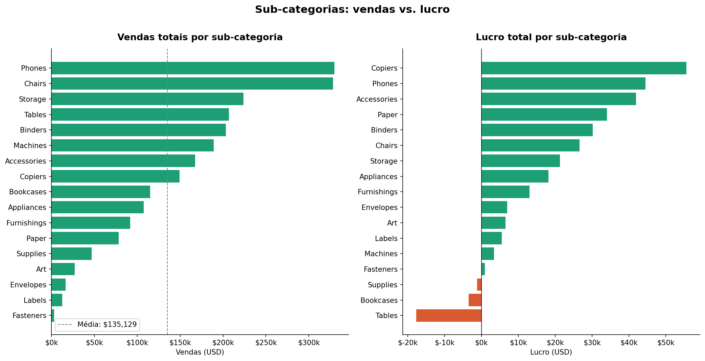
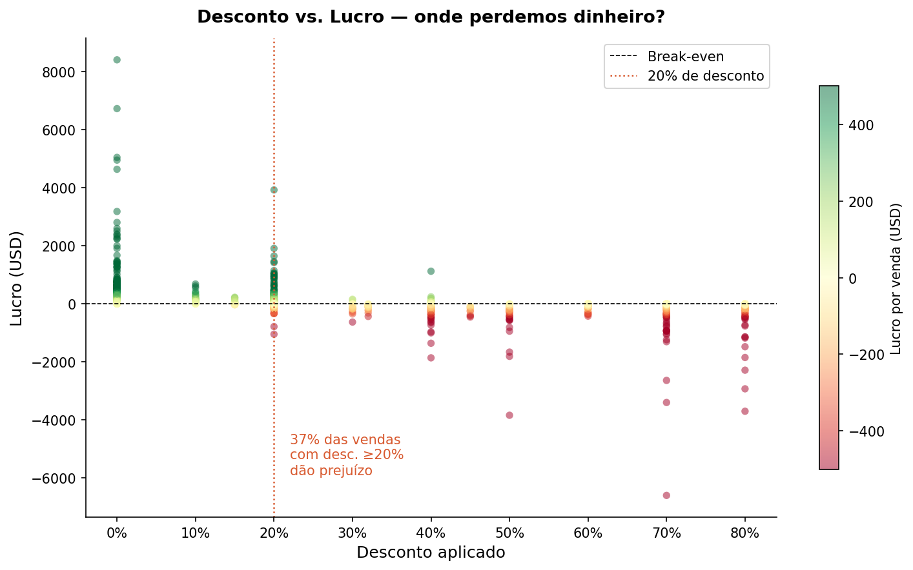
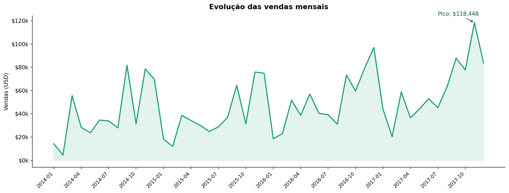
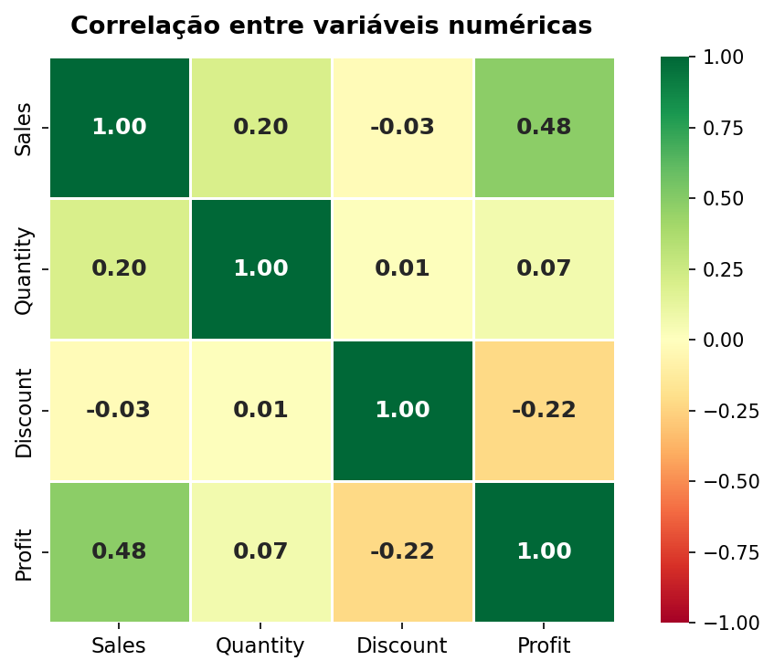

# Superstore Sales Analysis

Análise exploratória de dados de vendas de uma rede varejista americana com mais de 9.000 pedidos registrados entre 2015 e 2018. O objetivo foi entender o que impulsiona (e o que destrói) o lucro da operação.

---

## Perguntas que guiaram a análise

- Quais sub-categorias vendem mais — e quais estão dando prejuízo?
- Descontos altos realmente comprometem a margem?
- Existe sazonalidade nas vendas?
- Quais variáveis têm maior correlação com o lucro?

---

## Resultados

### Vendas e lucro por sub-categoria

Phones e Chairs lideram em vendas, mas nem todo volume vira lucro. Tables e Bookcases aparecem com margem negativa mesmo com volume relevante — o que indica problema de precificação ou política de desconto.



---

### Desconto vs. Lucro

Esse gráfico foi o que mais chamou atenção durante a análise. Existe uma concentração clara de prejuízo a partir de 20% de desconto. Vendas com desconto acima desse patamar têm probabilidade alta de resultado negativo — o que questiona a estratégia comercial atual.



---

### Sazonalidade das vendas

As vendas seguem um padrão consistente entre os anos: queda no início do ano e pico no Q4 (especialmente novembro). O crescimento ano a ano é visível, o que indica expansão da base de clientes.



---

### Correlação entre variáveis

O heatmap confirma o que o scatter já sinalizava: desconto tem correlação negativa com lucro. Quantidade vendida também não garante margem — o que reforça que volume sem controle de desconto é perigoso.



---

## Estrutura do projeto

```
superstore-analysis/
├── data/
│   └── Superstore.csv
├── images/
│   ├── 01_subcategoria.png
│   ├── 02_desconto_lucro.png
│   ├── 03_sazonalidade.png
│   └── 04_correlacao.png
├── notebook.ipynb
├── requirements.txt
└── README.md
```

---

## Como rodar

```bash
# Clone o repositório
git clone https://github.com/WalterAntunes/superstore-analysis.git
cd superstore-analysis

# Instale as dependências
pip install -r requirements.txt

# Abra o notebook
jupyter notebook notebook.ipynb
```

---

## Tecnologias

- Python 3.12
- pandas
- matplotlib
- seaborn

---

## Principais conclusões

Três pontos se destacaram ao longo da análise:

1. **Desconto é o maior vilão da margem.** A relação entre desconto e prejuízo é clara e consistente — acima de 20%, a maioria das vendas passa a ser deficitária.

2. **Nem toda sub-categoria deveria existir no portfólio.** Tables e Bookcases têm volume mas destroem valor. Uma revisão de mix faria diferença direta no lucro consolidado.

3. **O Q4 é crítico.** A concentração de vendas no final do ano cria risco operacional e oportunidade comercial ao mesmo tempo — dependendo de como a empresa se prepara para esse período.
